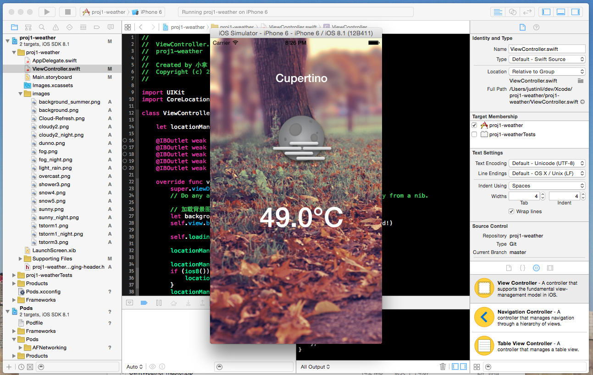

# Weather App for iOS

### 简介
通过Swift学习iOS开发之一：天气预报APP

### 功能
1. 创建 Single View Application with Swift
2. 利用 CoreLocation 模块获取当前位置信息（经纬度）
3. 安装库管理器 CocoaPods
4. 通过 CoacoaPods 配置文件，安装网络通信库 AFNetworking
5. 以经纬度为参数，通过 AFNetworking 调用接口获取天气数据
6. 解析数据，并更新当前温度 UILabel 和天气图片 UIImageView
7. 该实例也展示了进程指示器 UIActivityIndicatorView 的运用

### 展示

*justinli.ljt@gmail.com*
